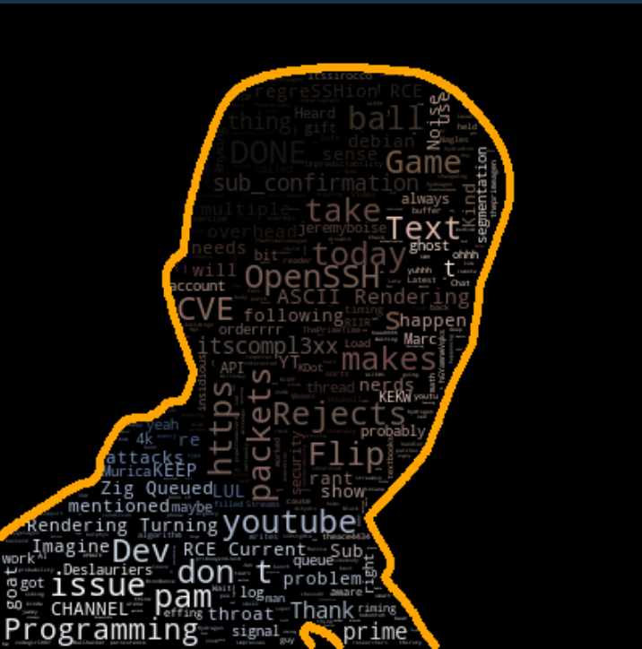

<div align="center">
      <h1> <br/>TwitchWordCloud</h1>
     </div>
<p align="center"> <a href="https://github.com/BobdaProgrammer/twitchwordcloud" target="_blank">
<p align="center">
    <a href="https://github.com/BobdaProgrammer/twitchwordcloud/pulse"></a>
    <a href="https://github.com/BobdaProgrammer/twitchwordcloud/stargazers"></a>
</p>

# Description
An easy way of forming word clouds from a twitch streamer's chat

# Screenshots



# Usage
```bash
node twitch.js <twitch streamer name> <image mask> <contour color (optional)>
```
`image mask` = the image that will contain the text in the result

# Requirements
- node (I am using v16.15.1)
- python (I am using 3.11.9)